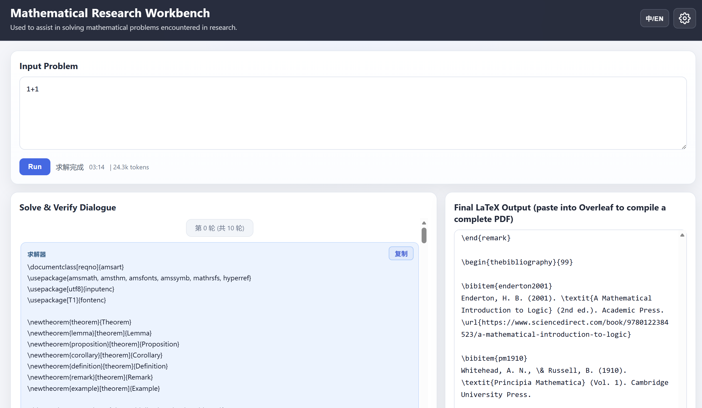

# Mathematical Research Assistant

[中文](./README.md) | [English](./README.en.md)

A locally runnable mathematical problem-solving system that uses a single-agent loop: "solve -> verify -> self-correct", with a web UI to display solver/verifier interaction and the final LaTeX output in real time.

## Showcase

### Web UI Example



### LaTeX Compilation Result Example (1+1)

- Compiled PDF: [`latex-demo.pdf`](./latex-demo.pdf)

## Key Features

- Custom LLM API settings: `Base URL`, `Model`, `API Key`, `temperature`, `max_tokens`
- Customizable system prompts (defaults are pre-filled from built-in prompts, no need to write from scratch)
- Frontend visualization of runtime status, solver/verifier dialog, and final LaTeX document
- One-click stop for the current run

## Project Structure

- `code/agent.py`: core solving and verification pipeline
- `ui_server/server.py`: Flask backend (task run, log parsing, result extraction, settings read/write)
- `ui_server/static/`: frontend files (`index.html` / `app.js` / `styles.css`)
- `ui_server/runs/`: per-run artifacts (logs, memory, config, metadata)
- `ui_server/settings.example.json`: config template (without secrets)
- `requirements.txt`: Python dependencies

## Quick Start

### 0) Clone the repository

```bash
git clone https://github.com/ml1301215/research-math-assistant.git
cd research-math-assistant
```

### 1) Install dependencies

```bash
pip install -r requirements.txt
```

### 2) Start web service

Run in repository root (`math-research-assistant/`):

```bash
python ui_server/server.py
```

Open in browser:

- `http://127.0.0.1:8000`

### 3) Configure your own LLM API

Open the settings panel in the top-right corner, then go to "Model API Settings":

- Base URL (for example, an OpenAI-compatible gateway)
- Model Name
- API Key
- temperature
- max_tokens

Notes:

- Leave API Key empty to keep the currently saved key
- Check "Clear saved API Key" to remove saved key

### 4) Configure prompts (optional)

Go to "Prompt Settings":

- Each prompt has a default value and a short description
- Edit on top of defaults, then save
- Click "Reset to default" to restore built-in prompts in `agent.py`

## CLI Usage (optional)

You can run `code/agent.py` directly:

```bash
python code/agent.py "<problem_file>" --log "<log_file>" --memory "<memory_file>" --config "<config_json>"
```

Common options:

- `--log`: log file path
- `--memory`: memory file path
- `--config`: override API/prompt settings
- `--max_runs`: maximum number of iterations
